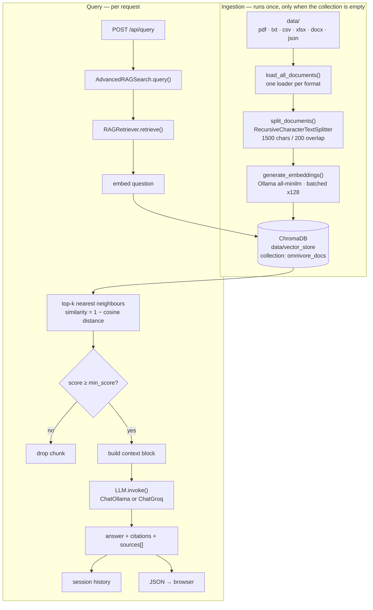

# Omnivore

**Feed it anything. Ask it anything. See the sources.**

A local-first Retrieval-Augmented Generation stack that turns any pile of documents into a queryable, citable knowledge base. Drop PDFs, Word files, spreadsheets, CSVs, JSON, or plain text into a folder, point Omnivore at it, and ask questions in plain language — every answer comes back with inline citations, per-source relevance scores, and a preview of the exact text the model saw.

Nothing leaves your machine by default: embeddings and generation both run through a local Ollama server.

```
┌──────────────────────────────────────────────────────────────┐
│  Omnivore                              ● Ollama · gemma2:9b  │
├──────────────────────────────────────────────────────────────┤
│  REQ 01   What were the Q3 renewal terms?                    │
│                                                              │
│  RESPONSE · 3184ms                                           │
│  The renewal window runs 60 days before expiry, with …       │
│                                                              │
│  SOURCES TRACED — 3                                          │
│  master_agreement.pdf       p.14  ████████░░  81%            │
│  master_agreement.pdf       p.17  ██████░░░░  63%            │
│  renewal_addendum.docx      p.2   ████░░░░░░  44%            │
└──────────────────────────────────────────────────────────────┘
```

The design goal is **traceability**: an answer you cannot audit is an answer you cannot trust. Omnivore refuses to answer from the model's own memory — if nothing in your documents clears the relevance threshold, it says so rather than guessing.

---

## Table of contents

- [What it eats](#what-it-eats)
- [Architecture](#architecture)
- [Project layout](#project-layout)
- [Prerequisites](#prerequisites)
- [Quickstart](#quickstart)
- [Using your own documents](#using-your-own-documents)
- [Configuration](#configuration)
- [HTTP API](#http-api)
- [Ingestion API](#ingestion-api)
- [Module reference](#module-reference)
- [Ingestion pipeline in detail](#ingestion-pipeline-in-detail)
- [Retrieval and scoring](#retrieval-and-scoring)
- [Frontend](#frontend)
- [Operational notes](#operational-notes)
- [Troubleshooting](#troubleshooting)
- [Known limitations](#known-limitations)
- [Extending the project](#extending-the-project)

---

## What it eats

[`load_all_documents`](src/rag/data_loader.py) recursively walks a directory and dispatches each file to a format-specific LangChain loader:

| Format | Extension | Loader | Notes |
|---|---|---|---|
| PDF | `.pdf` | `PyPDFLoader` | One document per page — this is what makes page-level citations possible |
| Plain text | `.txt` | `TextLoader` | |
| Spreadsheet | `.csv` | `CSVLoader` | One document per row |
| Excel | `.xlsx` | `UnstructuredExcelLoader` | Needs `unstructured` + `openpyxl` |
| Word | `.docx` | `Docx2txtLoader` | Needs `docx2txt` |
| JSON | `.json` | `JSONLoader` | Currently non-functional — see [Known limitations](#known-limitations) |

Every file is loaded inside its own `try/except`, so one corrupt PDF costs you that one file rather than aborting the whole ingest. Mixed-format directories are the expected case, not an edge case — nested subfolders are walked too.

Adding a seventh format is a dozen lines in one function; there is no plugin registry to learn.

---

## Architecture

Two distinct paths run through the system: a one-time **ingestion path** (cold start only) and a per-request **query path**.



**Layering.** Each module owns exactly one concern and depends only downward:

| Layer | Module | Responsibility |
|---|---|---|
| Presentation | `app.py`, `templates/`, `static/` | HTTP routes, wiring, UI |
| Orchestration | `rag/search.py` | Prompt assembly, citations, summarisation, history |
| Retrieval | `rag/retriever.py` | Query embedding, ANN search, score thresholding |
| Storage | `rag/vector_store.py` | ChromaDB lifecycle, ID generation, ingestion |
| Encoding | `rag/embedding.py` | Chunking + embedding (Ollama *or* SentenceTransformer) |
| Loading | `rag/data_loader.py` | Filesystem → LangChain `Document` |

Because the layers are decoupled, swapping any one of them is local: a different vector DB touches only `vector_store.py`, a different LLM touches only the `app.py` wiring, and a new file format touches only `data_loader.py`.

---

## Project layout

```
omnivore/
├── data/
│   ├── pdf_files/              # Sample corpus — replace with your own
│   ├── text_files/
│   └── vector_store/           # ChromaDB persistence (chroma.sqlite3 + HNSW index)
├── src/
│   ├── app.py                  # Flask entrypoint + pipeline wiring
│   ├── ingest_api.py           # Ingestion API (Blueprint — app.py untouched)
│   ├── rag/
│   │   ├── data_loader.py      # Multi-format document loading
│   │   ├── embedding.py        # EmbeddingManager: chunking + vectorisation
│   │   ├── vector_store.py     # VectorStore: ChromaDB wrapper
│   │   ├── retriever.py        # RAGRetriever: similarity search
│   │   └── search.py           # AdvancedRAGSearch: the RAG orchestrator
│   ├── templates/index.html    # Single-page UI shell
│   └── static/
│       ├── css/style.css       # Terminal-inspired dark theme
│       └── js/app.js           # Fetch calls, source bars, copy-to-clipboard
└── requirements.txt
```

The bundled `data/` holds a sample corpus of AWS data-engineering material, useful for verifying the pipeline end to end before you swap in your own documents.

---

## Prerequisites

| Requirement | Why | Notes |
|---|---|---|
| Python 3.10+ | Runtime | The checked-in `__pycache__` is CPython 3.14 |
| [Ollama](https://ollama.com) running locally | Default embedding **and** LLM backend | `http://localhost:11434` |
| `ollama pull all-minilm` | 384-dim embedding model | Required for both ingestion and query |
| `ollama pull gemma2:9b` | Answer generation | ~5.4 GB; needs ~8 GB RAM free |
| *(optional)* Groq API key | Cloud LLM alternative | Set `use_ollama_llm = False` |

Ollama must be reachable **before** the Flask app starts — `EmbeddingManager` sends a probe embedding at construction time and re-raises on failure, so a missing model kills startup rather than failing silently later.

---

## Quickstart

```powershell
# 1 — install
python -m venv myvenv
.\myvenv\Scripts\Activate.ps1
pip install -r omnivore/requirements.txt
pip install flask langchain-classic numpy      # see "Known limitations"

# 2 — pull models
ollama pull all-minilm
ollama pull gemma2:9b

# 3 — run (working directory matters, see below)
cd omnivore/src
python app.py
```

Open **http://127.0.0.1:5000**.

> **Run from `src/`.** Both `load_all_documents(data_dir='../data')` and the `VectorStore` default `persist_directory='../data/vector_store'` are relative paths. Launching from anywhere else creates a second, empty `data/vector_store` and silently re-ingests into it.

**First run vs. subsequent runs.** [`app.py:45-60`](src/app.py#L45-L60) checks `collection.count()` before doing any work. Cold start walks the full load → chunk → embed → ingest pipeline (minutes, depending on corpus size and CPU). Every later start prints `Collection already has N documents — skipping ingestion` and is up in seconds.

---

## Using your own documents

Use the [Ingestion API](#ingestion-api) — it adds documents to a running server, one file or a whole tree at a time, and skips anything already indexed:

```powershell
# everything under data/ that isn't already indexed (also the first-time init)
curl.exe -X POST http://127.0.0.1:5001/api/ingest

# one new file
curl.exe -X POST http://127.0.0.1:5001/api/ingest -H "Content-Type: application/json" -d "{\"path\": \"../data/reports/q3.pdf\"}"

# upload straight from your machine
curl.exe -F "file=@handbook.pdf" http://127.0.0.1:5001/api/ingest/upload
```

The older, restart-based route still works: drop files under `data/`, delete `data/vector_store/`, restart. It re-embeds the entire corpus, so it is only worth it for a full rebuild.

**A few things worth knowing before you point it at a large corpus:**

- **Budget the embedding time.** The bundled 7-file sample corpus (1788 pages → 2893 chunks) takes about 2½ minutes on CPU. Scale roughly linearly.
- **Deduplication is by file path**, so a document edited in place needs `mode=replace`; the default `skip` sees the path already present and leaves it alone.
- Scanned PDFs yield nothing. `PyPDFLoader` extracts an embedded text layer; it does not do OCR. Run such files through an OCR pass first.
- Keep the corpus coherent. Retrieval quality on a mixed grab-bag degrades quickly, because a `top_k` of 5 gets spread across unrelated subject matter. Separate corpora are better served by separate collections — see [Configuration](#configuration).

**Running multiple corpora.** `VectorStore` takes `collection_name` as a constructor argument, so several independent document sets can share one ChromaDB directory:

```python
vector_store = VectorStore(collection_name="contracts")   # or "research", "handbooks", …
```

Each name is an isolated index. Switching between them today means editing [`app.py:40`](src/app.py#L40) and restarting; wiring it to a dropdown in the UI is a natural next step.

---

## Configuration

All knobs currently live as module-level constants in [`app.py`](src/app.py). Nothing is read from the environment except the Groq key.

| Setting | Location | Default | Effect |
|---|---|---|---|
| `use_ollama_llm` | [`app.py:65`](src/app.py#L65) | `True` | `True` → `ChatOllama(gemma2:9b)`; `False` → `ChatGroq(gemma2-9b-it)` |
| `temperature` | [`app.py:67`](src/app.py#L67) | `0.1` | Low, deliberately — RAG answers should be extractive |
| `max_token` | [`app.py:66`](src/app.py#L66) | `1024` | Maps to `num_predict` (Ollama) / `max_tokens` (Groq) |
| `collection_name` | [`app.py:40`](src/app.py#L40) | `omnivore_docs` | ChromaDB collection — one per corpus |
| `model_name` (embedding) | [`app.py:39`](src/app.py#L39) | `all-minilm` | Ollama tag; must match what the store was built with |
| `data_dir` | [`app.py:55`](src/app.py#L55) | `../data` | Root of the document tree, walked recursively |
| `chunk_size` / `chunk_overlap` | [`embedding.py:81`](src/rag/embedding.py#L81) | `1500` / `200` | ~13% overlap preserves cross-boundary context |
| `batch_size` | [`embedding.py:101`](src/rag/embedding.py#L101) | `128` | Ollama embed batching |
| `top_k` | [`search.py:13`](src/rag/search.py#L13) | `5` | Chunks retrieved per query |
| `min_score` | [`search.py:13`](src/rag/search.py#L13) | `0.1` | Similarity floor (`1 − cosine distance`) |

**Tuning `chunk_size` to your documents.** The 1500/200 default suits prose and technical documentation. Dense reference material, tables, and Q&A-style content generally do better around 800/150, where each chunk stays on a single topic. Long-form narrative can go to 2000+. The overlap exists so a fact split across a chunk boundary still appears intact in one of them — keep it near 10–15% of `chunk_size`.

**Environment.** Create `.env` at the repo root:

```dotenv
GROQ_API_KEY=your_key_here
```

Loaded via `python-dotenv` at [`app.py:17`](src/app.py#L17). Only consulted when `use_ollama_llm = False`.

> ⚠️ **The `.env` currently in the repo root contains a live Groq key.** It is untracked today, but add `.env` to `.gitignore` and rotate that key before this repository is pushed anywhere.

**Changing the embedding model is a breaking change.** Embeddings are only comparable within the same model's vector space. If you switch from `all-minilm` to anything else, delete `data/vector_store/` and re-ingest — otherwise queries are embedded in one space and searched against another, producing confidently wrong results with no error.

---

## HTTP API

### `GET /`
Renders the Omnivore UI.

### `GET /api/status`
Reports the wired backend. Drives the status badge in the topbar.

```json
{
  "embedding_model": "all-minilm",
  "llm_backend": "Ollama",
  "llm_model": "gemma2:9b",
  "status": "online"
}
```

`status` is `"not configured"` when `rag is None` (retriever or LLM failed to construct).

### `POST /api/query`

**Request** — only `query` is required; omitted overrides fall through to `AdvancedRAGSearch.query`'s own defaults, so the API never accidentally pins them.

```json
{
  "query": "What are the renewal terms?",
  "top_k": 5,
  "min_score": 0.1,
  "summarize": false
}
```

**Response `200`**

```json
{
  "answer": "The renewal window runs 60 days before expiry…\n\nCitations:\n[1] master_agreement.pdf (page 14)",
  "summary": null,
  "sources": [
    {
      "source": "master_agreement.pdf",
      "page": 14,
      "score": 0.7412,
      "preview": "Either party may elect not to renew by providing…"
    }
  ],
  "elapsed_ms": 3184
}
```

| Status | Condition |
|---|---|
| `400` | Empty or whitespace-only `query` |
| `500` | Pipeline not wired (`rag is None`), or any exception inside `rag.query` |

Server-side latency is measured around the `rag.query` call only ([`app.py:138-143`](src/app.py#L138-L143)) — it covers embedding + ANN search + LLM generation, not HTTP overhead.

### `GET /api/history`

Returns the in-process query log accumulated by `AdvancedRAGSearch` since startup.

```json
{ "history": [ { "question": "...", "answer": "...", "sources": [], "summary": null } ] }
```

In-memory and single-process — it does not survive a restart, and with `debug=True` the reloader may reset it.

---

## Ingestion API

Lives in [`ingest_api.py`](src/ingest_api.py) as a Flask Blueprint, deliberately separate from `app.py`. It replaces the delete-the-folder-and-restart loop: documents can be added while the server is running, and re-running it is safe.

**Register it into the main app** (one line, when you want it) — passing the existing objects avoids loading a second copy of the embedding model:

```python
from ingest_api import ingest_bp, configure
configure(embedding_manager=embedding_manager, vector_store=vector_store)
app.register_blueprint(ingest_bp)
```

**Or run it standalone** on its own port, next to `app.py`:

```powershell
cd omnivore/src
python ingest_api.py          # http://127.0.0.1:5001
```

### Ingest modes

`VectorStore.ingest_documents` appends blindly, so this module deduplicates on the `source` metadata field every loader sets:

| Mode | Behaviour |
|---|---|
| `skip` *(default)* | Leave files already in the collection alone. Makes `POST /api/ingest` idempotent, and a no-op once initialization has run. |
| `replace` | Delete the existing chunks for that source, then re-ingest. The correct mode for a file that changed on disk. |
| `append` | Ingest regardless, duplicates included. Escape hatch only. |

Under `replace`, the delete happens only *after* embedding succeeds, so a failure mid-run cannot leave the collection missing the old chunks without having the new ones.

### `GET /api/ingest/status`

```json
{
  "collection": "omnivore_docs",
  "chunks": 2893,
  "source_files": ["C:\\...\\aws_dms_documentation.pdf", "..."],
  "source_file_count": 7,
  "data_dir": "C:\\...\\omnivore\\data",
  "supported_extensions": [".csv", ".docx", ".json", ".pdf", ".txt", ".xlsx"]
}
```

### `POST /api/ingest`

Every field is optional. A bare `POST` with no body ingests everything under `data/` that is not already present — this is the **initialization** call, and it is safe against a populated store.

```json
{
  "path": "../data",
  "mode": "skip",
  "chunk_size": 1500,
  "chunk_overlap": 200
}
```

`path` accepts a single file or a directory; directories are walked recursively.

```json
{
  "collection": "omnivore_docs",
  "mode": "skip",
  "files_found": 7,
  "files_ingested": 7,
  "files_skipped": 0,
  "files_failed": 0,
  "documents_loaded": 1788,
  "chunks_added": 2893,
  "chunks_replaced": 0,
  "chunks_before": 0,
  "chunks_after": 2893,
  "elapsed_ms": 158773,
  "details": [
    {"file": "...\\python_intro.txt", "status": "ingested", "documents": 1, "replaced_chunks": 0},
    {"file": "...\\stale.pdf", "status": "skipped", "reason": "already ingested", "existing_chunks": 12},
    {"file": "...\\broken.pdf", "status": "error", "reason": "loader produced no text (scanned PDF with no text layer?)"}
  ]
}
```

`details` is per file, so a partial success reports exactly which files landed and which did not — one bad file never fails the batch.

### `POST /api/ingest/upload`

Multipart upload. Files are saved under `data/uploads/` and ingested in one step. The form field is `file`, repeatable for multiple uploads.

```powershell
curl.exe -F "file=@handbook.pdf" -F "mode=replace" http://127.0.0.1:5001/api/ingest/upload
```

Defaults to `mode=replace`, since re-uploading a filename normally means "this is the new version." Filenames pass through `secure_filename`, so an upload cannot escape `data/uploads/`. Unsupported extensions come back in a `rejected` array rather than failing the whole request. The 100 MB cap applies in standalone mode only — `MAX_CONTENT_LENGTH` is set in `create_app()`, so registering the blueprint into `app.py` inherits that app's limit instead.

| Status | Condition |
|---|---|
| `400` | Bad mode, non-integer or overlapping chunk params, no file in upload |
| `404` | `path` does not exist |
| `500` | Embedding or storage failed mid-run |
| `503` | Ollama unreachable, or the vector store failed to initialize |

### Concurrency

Ingestion is serialized behind a `threading.Lock` — concurrent runs would interleave their dedup checks and defeat them.

Across *processes* there is no such protection. ChromaDB's `PersistentClient` is backed by SQLite, which does not expect two processes writing the same database, so running this standalone while `app.py` is also up is fine for read-mostly querying but a large ingest can lock the file long enough for a query to fail. For heavy use, register the blueprint into `app.py` so both share one client in one process.

---

## Module reference

### `EmbeddingManager` — [`src/rag/embedding.py`](src/rag/embedding.py)

Dual-backend encoder. The Ollama path (default) avoids any HuggingFace download entirely, which makes the project viable on an air-gapped or proxy-restricted machine.

- **`__load_model()`** — for Ollama, sends a single `embed(input="test")` probe and derives `embedding_dim` from the response, so an unreachable server or unpulled model fails loudly *at construction*, not at first query.
- **`split_documents(documents, chunk_size=1500, chunk_overlap=200)`** — `RecursiveCharacterTextSplitter` with separators `['\n\n', '\n', ' ', '']`, descending in granularity so paragraph boundaries win over word boundaries.
- **`generate_embeddings(texts, batch_size=128)`** — chunks the input into batches with per-batch progress logging. Defensively coerces `List[Document]` → `List[str]` if a caller passes documents instead of raw text. Returns `np.ndarray` of shape `(n, embedding_dim)`.
- **`__repr__`** — prints backend, model, and dimension, so `embedding_manager` alone in a notebook cell is a useful health check.

### `VectorStore` — [`src/rag/vector_store.py`](src/rag/vector_store.py)

Thin, honest wrapper over a `chromadb.PersistentClient`.

- `get_or_create_collection` makes construction idempotent — restarting never destroys the index.
- `ingest_documents` asserts `len(documents) == len(embeddings)` up front, then builds parallel `ids / metadatas / documents / embeddings` arrays for a single `collection.add()`.
- IDs are `doc_{uuid4[:10]}_{idx}` — collision-resistant *and* order-preserving for debugging.
- Metadata is enriched with `doc_index` and `content_length` on top of whatever the loader supplied (`source`, `page`, …). Since each loader sets its own metadata, this is where format-specific provenance survives into the citations.

### `RAGRetriever` — [`src/rag/retriever.py`](src/rag/retriever.py)

Embeds the query with the *same* `EmbeddingManager` used at ingestion (the single most important invariant in the system), runs `collection.query(n_results=top_k)`, converts Chroma's cosine **distance** to a **similarity** via `1 - distance`, filters by `score_threshold`, and returns enriched dicts:

```python
{'id', 'content', 'metadata', 'similarity_score', 'distance', 'rank'}
```

Failures are swallowed and returned as `[]`, which `AdvancedRAGSearch` handles as "no relevant context found" rather than a 500.

### `AdvancedRAGSearch` — [`src/rag/search.py`](src/rag/search.py)

The orchestrator.

1. **Retrieve** `top_k` chunks above `min_score`.
2. **Short-circuit** — if nothing survives the threshold, return `"No relevant context found."` *without calling the LLM*. This is deliberate: it prevents the model from answering from parametric memory and presenting it as grounded.
3. **Assemble context** — chunks joined with `\n\n` into a single grounding block.
4. **Generate** via `llm_model.invoke()` — any LangChain chat model works, since only `.invoke()` and `.content` are relied upon.
5. **Cite** — appends `[n] <source> (page <p>)` lines, indices aligned with the `sources` array the UI renders.
6. **Summarise** *(optional)* — a second LLM call condensing the answer to two sentences.
7. **Record** — appends to `self.history`.

### `load_all_documents` — [`src/rag/data_loader.py`](src/rag/data_loader.py)

Recursively globs `**/*` once per supported extension and hands each match to its loader. See [What it eats](#what-it-eats) for the format table. Verbose `[DEBUG]` logging reports the file count found per format and the document count produced by each file, which is the fastest way to spot a format that silently loaded nothing.

---

## Ingestion pipeline in detail

| Stage | Input | Output | Notes |
|---|---|---|---|
| Load | `data/**` | `List[Document]` | PDFs yield one `Document` per page, carrying `source` + `page` metadata — this is what makes page-level citations possible |
| Split | `List[Document]` | ~N× chunks | 1500 chars with 200 overlap; metadata is inherited by every chunk |
| Embed | `List[str]` | `(N, 384)` array | Batched at 128; `all-minilm` is 384-dimensional |
| Ingest | chunks + vectors | ChromaDB rows | Single `add()` call; HNSW index persists to `data/vector_store/` |

Metadata granularity varies by format, and this shows up directly in your citations. PDFs carry a real `page`; text, Word, and Excel files generally do not, so `search.py` falls back to `'unknown'` for those. If page-level provenance matters for a given corpus, PDF is the format that gives it to you for free.

The `content_length` metadata field is worth keeping in mind when tuning: chunks far below `chunk_size` are usually document tails or short pages, and they tend to score noisily.

---

## Retrieval and scoring

ChromaDB returns **cosine distance**; the UI wants **similarity**. The conversion at [`retriever.py:34`](src/rag/retriever.py#L34) is `similarity = 1 - distance`, giving roughly:

| Similarity | Reading |
|---|---|
| `> 0.75` | Strong lexical + semantic overlap; near-verbatim source |
| `0.45 – 0.75` | Genuinely relevant, paraphrased |
| `0.20 – 0.45` | Topical but weak — usually noise in a small corpus |
| `< 0.20` | Unrelated |

The default `min_score = 0.1` is permissive by design: it favours recall on a small corpus where an over-strict floor would leave the model with no context at all. Raise it toward `0.35` once the corpus grows and false-positive chunks start crowding out real ones.

Note that `top_k` is applied by ChromaDB **before** thresholding, so a query can return fewer than `top_k` chunks — never more.

---

## Frontend

A dependency-free single page (no framework, no build step) styled as a diagnostics console.

- **`fetchStatus()`** polls `/api/status` on load and renders a green/red dot plus `backend · model · embedder`.
- **Entries** are numbered `REQ 01`, `REQ 02`, … with an animated five-bar trace loader while the request is in flight.
- **Source rows** animate their relevance bar to `score × 100%` on the next frame (`requestAnimationFrame`), so CSS transitions actually fire.
- **`escapeHtml()`** routes every model- and user-supplied string through `textContent`, so retrieved document text cannot inject markup.
- **Copy answer** writes the raw answer to the clipboard with transient `copied` feedback.
- **Reset** clears the visual log client-side only — server-side `rag.history` is untouched.
- Enter submits; the input is disabled for the duration of the request to prevent double-sends.

---

## Operational notes

**Ingestion runs at import time.** The load/chunk/embed block sits at module scope in `app.py`, not inside a route or `if __name__ == "__main__"`. With `debug=True` the Werkzeug reloader imports the module in a second process, so on a cold start you may see the ingestion banner twice. The `count() > 0` guard makes the second pass a no-op in practice, but for production use `debug=False` and move ingestion behind an explicit CLI step.

**Single-process assumptions.** `rag.history` lives in process memory. Any multi-worker deployment (gunicorn `-w 2`, etc.) gives each worker its own disjoint history, and `/api/history` returns whichever worker answered.

**Re-indexing.** Delete `data/vector_store/` and restart.

---

## Troubleshooting

| Symptom | Cause | Fix |
|---|---|---|
| Startup raises from `EmbeddingManager` | Ollama not running, or `all-minilm` not pulled | `ollama serve`; `ollama pull all-minilm` |
| `pipeline unreachable` in the status badge | Flask up but `/api/status` failing, or server down | Check the terminal for the traceback |
| `"No relevant context found."` for a fair question | Empty collection, or `min_score` too high | Verify `collection.count() > 0`; lower `min_score` |
| A format loaded zero documents | Missing optional dependency, or an unreadable file | Check the `[DEBUG] Found N … files` and `[ERROR]` lines at startup |
| A PDF contributes nothing | Scanned image with no text layer | OCR it before ingesting — `PyPDFLoader` does not |
| Citations show `page unknown` | Format carries no page metadata (txt, docx, xlsx) | Expected; only PDFs provide real page numbers |
| Documents re-ingest on every start | App launched from the wrong directory | `cd omnivore/src` before `python app.py` |
| Duplicate chunks in results | Ingestion ran against a populated collection, or `mode=append` was used | Delete `data/vector_store/` and rebuild, or re-ingest that file with `mode=replace` |
| An edited document still returns its old text | Dedup keys on path, so `skip` left it alone | Re-ingest it with `mode=replace` |
| `database is locked` during ingest | Two processes writing the same ChromaDB SQLite | Register the blueprint into `app.py` instead of running `ingest_api.py` standalone |
| `Pipeline error: …` in a response entry | Exception inside `rag.query` — usually the LLM call | Confirm `gemma2:9b` is pulled and RAM is available |
| Answers ignore the documents | Embedding model changed without re-indexing | Delete `data/vector_store/` and re-ingest |
| `ModuleNotFoundError: flask` / `langchain_classic` | Missing from `requirements.txt` | See below |

---

## Known limitations

Findings from a read-through of the current code, worth knowing before you extend it:

1. **`requirements.txt` is incomplete.** `flask`, `langchain-classic`, and `numpy` are imported but unlisted. Excel and Word loading additionally need `unstructured`/`openpyxl` and `docx2txt` — without them those two formats fail silently into the per-file `except`.
2. **The SentenceTransformer path is broken.** [`embedding.py:75`](src/rag/embedding.py#L75) calls `self.model.get_embedding_dimension()`; the actual API is `get_sentence_embedding_dimension()`. `use_ollama=False` will raise `AttributeError`. Only the Ollama path is exercised today.
3. **`data_loader.py` calls `JSONLoader` without `jq_schema`**, which that loader requires — any `.json` file is caught by the `except` and skipped rather than loaded. JSON is therefore nominal on the `app.py` startup path. [`ingest_api.py`](src/ingest_api.py) reads JSON with the standard library instead, which both works and avoids the `jq` dependency (no Windows wheel).
4. **`stream=True` does not stream the LLM.** [`search.py:30-35`](src/rag/search.py#L30-L35) prints the *prompt* to stdout in 80-char slices with a `sleep`, then makes an ordinary blocking `invoke()`. It is a placeholder, and no API route exposes it. Real streaming needs `llm_model.stream()` plus an SSE endpoint.
5. **`summarize` is reachable but unused.** `/api/query` accepts and forwards it, and the response carries `summary`, but `app.js` never sends it and never renders it.
6. **Docstring/default drift.** The comment at [`app.py:129`](src/app.py#L129) claims `min_score=0.2`; the actual default in `AdvancedRAGSearch.query` is `0.1`.
7. **`VectorStore.__initialize_store` swallows its exception.** On failure it prints and leaves `self.collection = None`, so the real error surfaces later as a confusing `AttributeError` in the retriever. `app.py` partly anticipates this with its `except AttributeError` guard around `count()`.
8. **`app.py`'s own ingestion path has no deduplication and no incremental update.** Nothing keys on file content or path, so re-running it against a non-empty collection duplicates every chunk, and adding one file means re-embedding the corpus. The `count() > 0` guard is the only thing preventing this. [`ingest_api.py`](src/ingest_api.py) solves both — prefer it over restart-based ingestion.
9. **`debug=True` is hardcoded** in `app.run()` — fine locally, unsafe anywhere else.

---

## Extending the project

- **More formats** — Markdown, HTML, EPUB, and PowerPoint all have LangChain loaders; each is a dozen lines in `load_all_documents` following the existing pattern.
- **Corpus switching in the UI** — `VectorStore` already keys on `collection_name`; expose it as a dropdown and Omnivore serves several document sets from one process.
- **Content-hash dedup** — [`ingest_api.py`](src/ingest_api.py) dedupes on file *path*, so an edited file needs an explicit `mode=replace`. Storing a content digest in metadata would let `skip` detect changes on its own.
- **Streaming responses** — swap `invoke()` for `stream()` and expose an SSE route; the UI's entry placeholder is already structured to be filled incrementally.
- **Hybrid retrieval** — add BM25 alongside the dense search and fuse with Reciprocal Rank Fusion; keyword matching materially helps on identifier-heavy technical documents.
- **Reranking** — insert a cross-encoder between retrieval and generation: fetch `top_k=20`, rerank, keep 5.
- **Persistent history** — move `AdvancedRAGSearch.history` to SQLite so it survives restarts and multiple workers.
- **Evaluation harness** — a fixed question set scored on retrieval hit-rate and answer faithfulness, so tuning `chunk_size` / `top_k` / `min_score` stops being guesswork.
- **Config externalisation** — lift the `app.py` constants into `.env` or a YAML config so corpora and backends can be switched without editing code.
